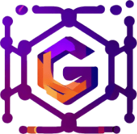

  

# Graphitation

GraphQL tooling & runtime support needed for MS Teams and beyond

## Packages

- [@graphitation/apollo-mock-client](./packages/apollo-mock-client): An Apollo Client that allows mocking of payloads in response to operations, rather than having to provide them all upfront.
- [@graphitation/apollo-react-relay-duct-tape](./packages/apollo-react-relay-duct-tape): A compatibility wrapper that provides the react-relay API on top of Apollo Client.
- [@graphitation/graphitation-cli](./packages/graphitation-cli): binaries for the codegen and extractors.
- [@graphitation/graphql-codegen](./packages/graphql-codegen): generates resolver types and models.
- [@graphitation/graphql-codegen-supermassive-schema-extraction-plugin](./packages/graphql-codegen-supermassive-schema-extraction-plugin): GraphQL codegen supermassive schema extraction.
- [@graphitation/graphql-js-operation-payload-generator](./packages/graphql-js-operation-payload-generator): Generates a payload for a given GraphQL operation expressed in graphql-js AST and a GraphQL Schema.
- [@graphitation/graphql-js-tag](./packages): A simple graphql-js AST based `graphql` tagged template function.
- [@graphitation/graphql-eslint-rules](./packages/graphql-eslint-rules): Graphql eslint rules
- [@graphitation/rempl-apollo-devtools](./packages/apollo-devtools): Rempl apollo devtools
- [@graphitation/supermassive](./packages/supermassive): Supermassive is a lightweight schema-less GraphQL executor and query build-time compiler
- [@graphitation/supermassive-extractors](./packages/supermassive-extractors): extracts implicit resolvers
- [relay-compiler-language-graphitation](./packages/relay-compiler-language-graphitation): A relay-compiler plugin that wraps [the TypeScript plugin](https://github.com/relay-tools/relay-compiler-language-typescript) and augments it slightly for [@graphitation/apollo-react-relay-duct-tape](./packages/apollo-react-relay-duct-tape)'s needs.

## Contributing

Please see [CONTRIBUTING.md](CONTRIBUTING.md) for development instructions.

This project welcomes contributions and suggestions. Most contributions require you to agree to a
Contributor License Agreement (CLA) declaring that you have the right to, and actually do, grant us
the rights to use your contribution. For details, visit https://cla.opensource.microsoft.com.

When you submit a pull request, a CLA bot will automatically determine whether you need to provide
a CLA and decorate the PR appropriately (e.g., status check, comment). Simply follow the instructions
provided by the bot. You will only need to do this once across all repos using our CLA.

This project has adopted the [Microsoft Open Source Code of Conduct](https://opensource.microsoft.com/codeofconduct/).
For more information see the [Code of Conduct FAQ](https://opensource.microsoft.com/codeofconduct/faq/) or
contact [opencode@microsoft.com](mailto:opencode@microsoft.com) with any additional questions or comments.

## Trademarks

This project may contain trademarks or logos for projects, products, or services. Authorized use of Microsoft
trademarks or logos is subject to and must follow
[Microsoft's Trademark & Brand Guidelines](https://www.microsoft.com/en-us/legal/intellectualproperty/trademarks/usage/general).
Use of Microsoft trademarks or logos in modified versions of this project must not cause confusion or imply Microsoft sponsorship.
Any use of third-party trademarks or logos are subject to those third-party's policies.
