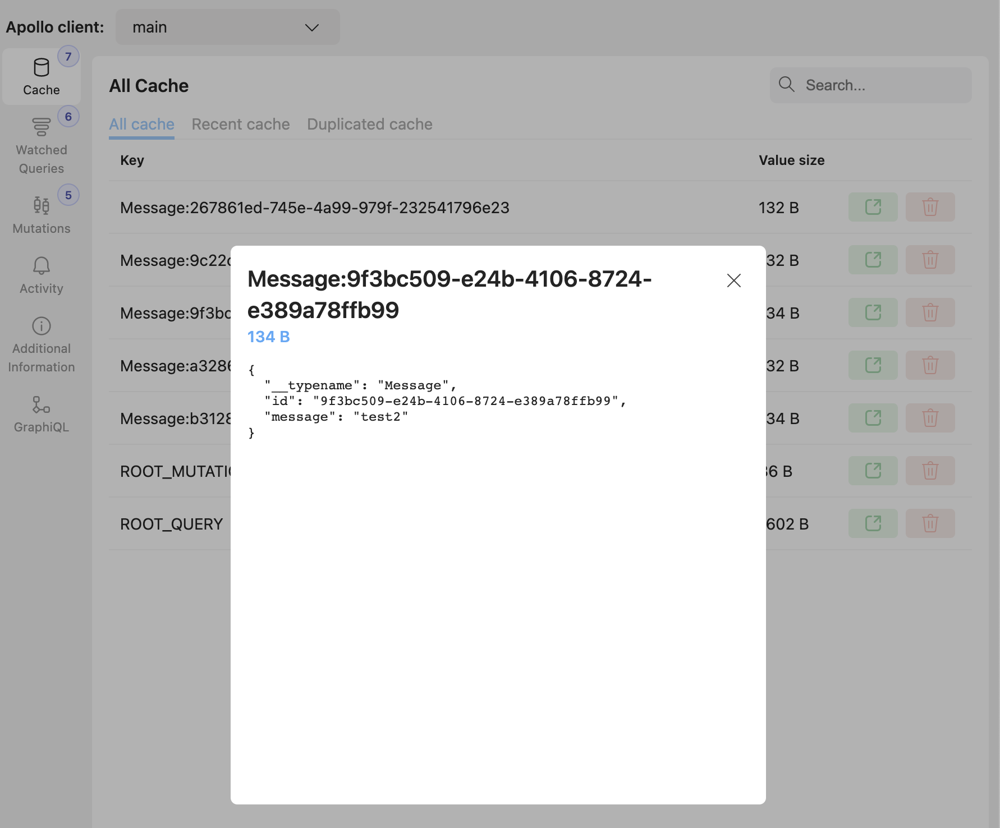
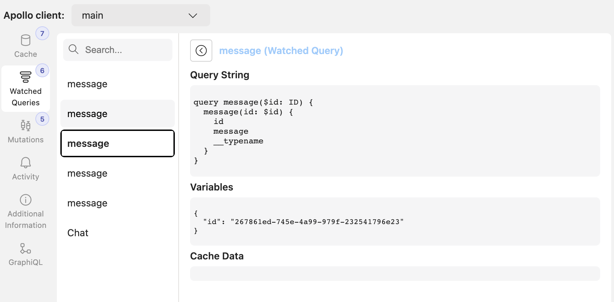
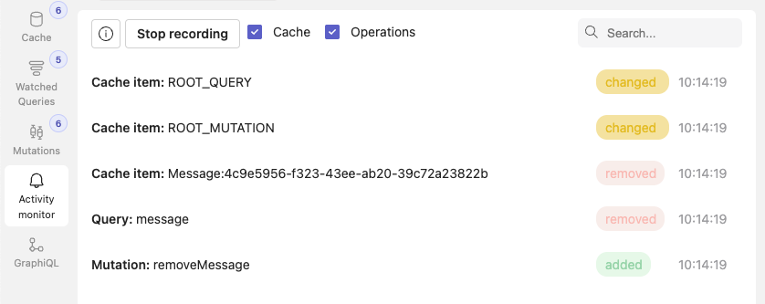
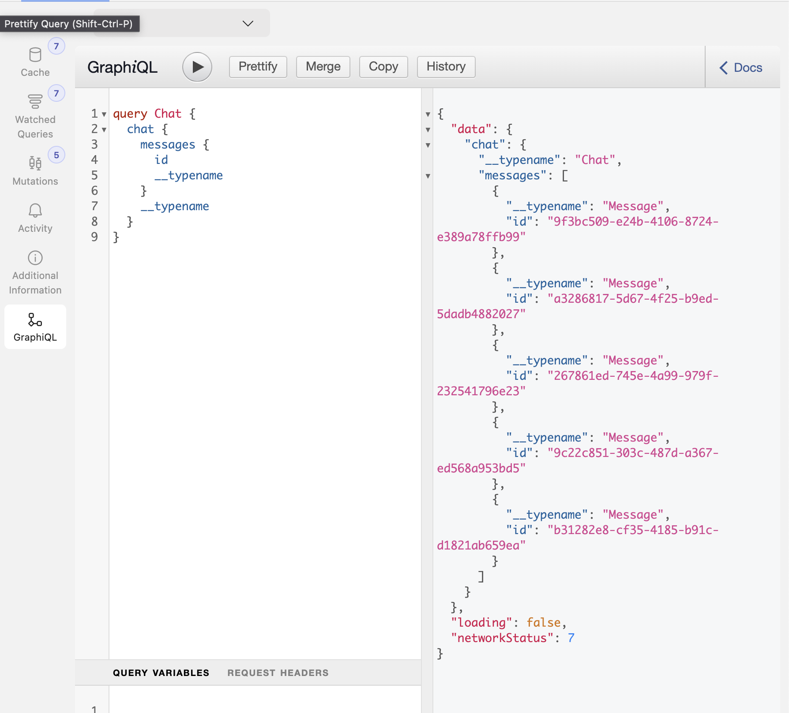

# Apollo Devtools

## Features

Rempl Apollo Devtools allows you to debug multiple apollo clients. This tool contains the following features:

### Cache inspector

- Allow seeing the content of the cache and allows you to remove a specific object from the cache. Possibility to record only recent changes.



### Watched Query and Mutation inspector

Observe active queries, or recently fired mutations.



### Recent Activity

[EXPERIMENTAL FEATURE - Results may not be 100% accurate] It monitors changes in cache, fired mutations and activated/deactivated queries.



### Operations Tracker

It records all the operations done via Apollo client. [More info](./docs/operations-tracker.md)

### GraphiQL

Allows sending custom queries (using https://github.com/graphql/graphiql)



## Playground

You can try the devtools using `yarn playground`

## Installation

1. First off, you need to include the bundled library's script into your site.

```
yarn add rempl-graphql-devtools
```

include `dist/apollo-devtools.js` in Webpack

```
webpackConfig.entry["apollodevtools"] = PROJECT_ROOT("node_modules/rempl-graphql-devtools/dist/apollo-devtools.js");
```

OR

build the library and include `<script>` with `dist/apollo-devtools.js`in your HTML page.
`<script src="path/apollo-devtools.js"></script>`

2. In your project, you need to attach the apollo client(s) instance into the global variable **APOLLO_CLIENTS**

```
const client = new ApolloClient({
  uri: 'https://48p1r2roz4.sse.codesandbox.io',
  cache: new InMemoryCache()
});

window.__APOLLO_CLIENTS__ = [{client, clientId: "custom_name"}]
```

## Usage

### Mac

To open devtools press cmd+option+shift+0

### Windows

To open devtools press ctrl+alt+shift+0

## Contributing

This project welcomes contributions and suggestions. Most contributions require you to agree to a
Contributor License Agreement (CLA) declaring that you have the right to, and actually do, grant us
the rights to use your contribution. For details, visit https://cla.opensource.microsoft.com.

When you submit a pull request, a CLA bot will automatically determine whether you need to provide
a CLA and decorate the PR appropriately (e.g., status check, comment). Simply follow the instructions
provided by the bot. You will only need to do this once across all repos using our CLA.

This project has adopted the [Microsoft Open Source Code of Conduct](https://opensource.microsoft.com/codeofconduct/).
For more information see the [Code of Conduct FAQ](https://opensource.microsoft.com/codeofconduct/faq/) or
contact [opencode@microsoft.com](mailto:opencode@microsoft.com) with any additional questions or comments.

## Trademarks

This project may contain trademarks or logos for projects, products, or services. Authorized use of Microsoft
trademarks or logos is subject to and must follow
[Microsoft's Trademark & Brand Guidelines](https://www.microsoft.com/en-us/legal/intellectualproperty/trademarks/usage/general).
Use of Microsoft trademarks or logos in modified versions of this project must not cause confusion or imply Microsoft sponsorship.
Any use of third-party trademarks or logos are subject to those third-party's policies.
