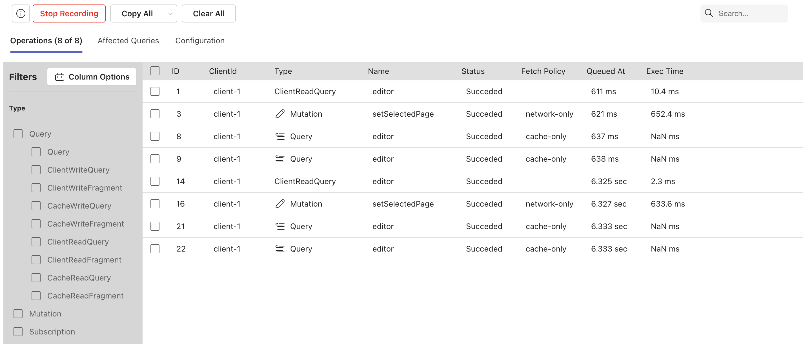
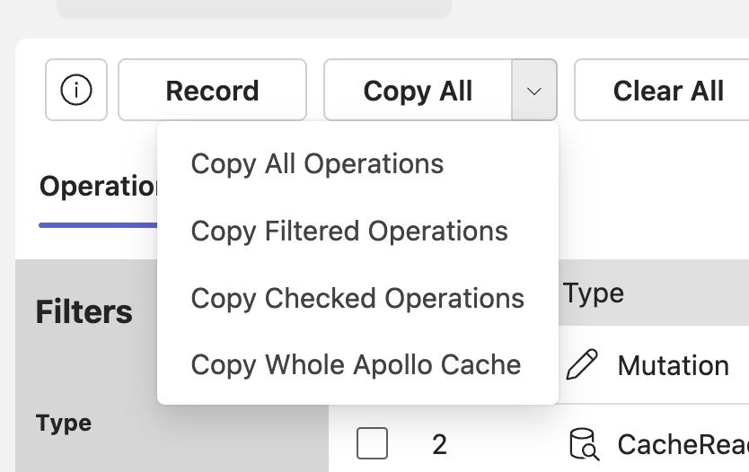
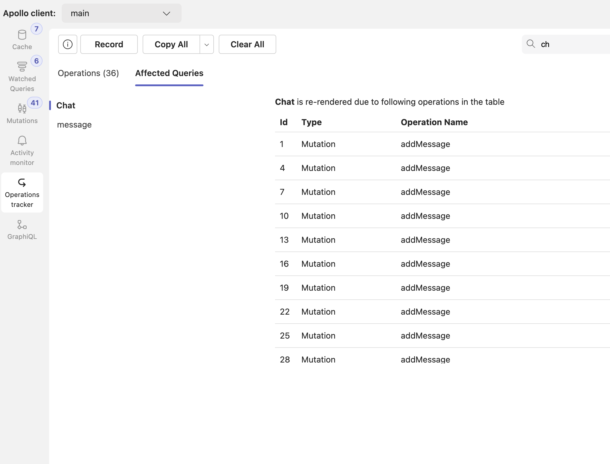

# Operations Tracker

Records all operations being executed via Apollo client in a given time and shows info about each operation.

## What kind of issues can be debugged using the tool

- Helps figuring out `unwanted operations` being fired in render phase
- Help in figuring out the reasons for `multiple re-renders` of the same watch query​
- Help figuring out issues with `conflicting queries​`
- Shows field name in case `missing field error`
- Detailed time info lets you figure out if queries are being fired in `Waterfall model` or not.
- Helps figuring out if `data is taking too much time` to get written to cache.

## Built in features

- Tracks all operations Query, Mutation, subscription, client.readQuery, client.writeQuery, cache.readQuery, cache.writeQuery, client.readFragment, client.writeFragment, cache.readFragment, cache.writeFragment.
- For each operations, below info is available
  - Operation Name
  - Operation Type
  - Failure or Succeded
  - Fetch policy
  - Total execution time
  - Operation queued at time
  - Size in KB of the result of the Operation
- There are filters present using which, one can filter operations list
  - Operation type filter (Query/Mutation/Subscription)
  - Results from filter (Cache/Network)
  - Operation Status (Succeeded/Failed)
- It also shows which all operations are responsible for re-rendering of an query in `Affected Queries` view
- It allows you copy operations data in JSON format.

## How to use

1. Go to Operations tracker
2. Click on Record button
3. Do some changes in UI.
4. Click on Stop button

 5. Click on a operation to see detailed view

6. One can select operation to copy by checking the checkboxes for each operation.

## Filter options

- Supports comma separate search text to search multiple operations
- Filter by Operation type (Query/Mutation/Subscription)
- Filter by from where the result is being fetched (Cache/Network)
- Filter by operation status (Succeded/Failed)

## Copy options

### Copy All Operations

It copies all the operations which have been recorded

### Copy Filtered Operations

It copies only the current view of the operations

### Copy Checked Operations

It copies only those operations, whose check boxes are checked

### Copy currently Opened Operatio

It copies the operation, which is currently opened in the detailed view

### Copy Whole Apollo Cache

It copies the whole Apollo Cache object

## Affected Queries view

This view shows what operations led to re-render of a given query.
On the left side is the list of queries which have been re-rendered and on the right side, it shows what all operation caused it.

