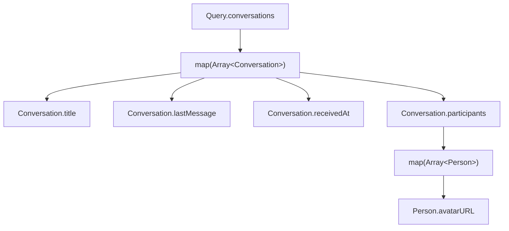

# GraphQL Resolution

The role of an execution engine in GraphQL is to convert between underlying services into GraphQL schema types for use in the front-end. We call this “resolution”.

It does so by traversing the schema and resolving the fields requested in the query. The executor follows the structure of the query and passes the data returned by each field resolver to its child field resolvers. The executor ensures that only the fields that are requested by the client are resolved, and that the final result matches the shape of the query.

## Get only what you need

A core part of GraphQL is that it allows clients to specify **the exact data** they need from the service. Unlike traditional RESTful APIs, where clients have to make multiple requests or receive more data than they need, GraphQL lets clients define the structure of the data they want and get **_only_ that data** in a single request. Notably, this means that the client does not need to pay the price for any business logic required for fields that are not needed by the client. This makes GraphQL APIs more efficient, flexible, and scalable to clients that have such needs.

## Execution

To resolve the data of the GraphQL query, we need to define how each field in the schema is fetched from the data source. There are different ways to do this, depending on how we structure our code and how we optimize our performance. In this section, we will explore two examples of how to resolve the data of the query, starting with a naive version that simply returns the full entire response from the root-field, to one that has explicit field resolvers for each field with custom logic.

But first, let's quickly cover how the executor will process your query. Let's consider the conversation list UI once more:

<table>
<tr>
<th>Schema</th>
<th>Query</th>
</tr>
<tr>
<td>

```graphql
type Query {
  conversations: [Conversation]
}

type Conversation {
  title: String
  lastMessage: String
  receivedAt: String
  participants: [Person]
}

type Person {
  avatarURL: String
}
```

</td>
<td>

```graphql
query {
  conversations {
    title
    lastMessage
    receivedAt
    participants {
      avatarUrl
    }
  }
}
```

</td>
</tr>
</table>



In this case, when we query for conversations, GraphQL will:

1. Execute the resolver function for the `Query.conversations` field, which returns an array of `Conversation` objects.
1. Then, for each `Conversation` object in the array, GraphQL will execute the resolver function for the `Conversation.title`, `Conversation.lastMessage`, `Conversation.receivedAt`, and `Conversation.participants` fields.
1. And finally, for each `Person` object in the `Conversation.participants` array, GraphQL will execute the resolver function for the `Person.avatarURL` field.

:::info
For a more details on the functional bits of execution, please refer to [this graphql.org page](https://graphql.org/learn/execution/), or [the spec](http://spec.graphql.org/October2021/#sec-Execution).
:::

### 👎 Greedy resolution

The first example is the simplest one, where we just return the full response from the root-field. This means that we have a single resolver function for the `conversations` field in the `Query` type, and it returns an array of objects that match the shape of the `Conversation` type. We don't need to define any other resolver functions for the nested fields, because GraphQL will [by default](#a-note-on-the-default-field-resolver) use the property values of the objects as the field values.

For example, if we have a data source that looks like this:

```js
const conversations = [
  {
    title: "Joshua and Daichi",
    lastMessage: "You: Thank you!!",
    receivedAt: "10:29 AM",
    participants: [
      {
        avatarURL: "https://example.com/joshua.jpg",
      },
      {
        avatarURL: "https://example.com/daichi.jpg",
      },
    ],
  },
  {
    title: "Kadji Bell",
    lastMessage: "You: I like the idea, let’s pitch it!",
    participants: [
      {
        avatarURL: "https://example.com/kadji.jpg",
      },
    ],
    receivedAt: "10:02 AM",
  },
];
```

Then our resolver function for the conversations field can simply return this array:

```js
const resolvers = {
  Query: {
    conversations: () => conversations,
  },
};
```

This approach is easy to implement, and while it works for trivial queries and data sources, it has some drawbacks. For instance, it does not follow the core idea of GraphQL to [get only what you need](#get-only-what-you-need), which leads to inefficient resource usage and performance issues. If we only want to get the `title` and `lastMessage` fields of each conversation, we still get the participants array with _all_ their `avatarURLs`. This may seem innocuous in this contrived example, but imagine more complex data sources that require expensive logic to fulfil the participants data, and it can quickly add up.

:::note

### A note on the default field resolver

The default field resolver is a function that GraphQL uses to resolve the value of a field when no explicit resolver is provided. It works by looking up the property with the same name as the field on the parent object, or calling it as a function if it is one. For example, if we have a field called `title` on a type called `Conversation`, and no resolver for it, the default field resolver will try to return `conversation.title` or call `conversation.title()` if it exists.

The following set of resolvers has the same result as the above, but _without_ relying on the default field resolver:

```js
const resolvers = {
  Query: {
    conversations: () => conversations,
  },
  Conversation: {
    title: (conversation) => conversation.title,
    lastMessage: (conversation) => conversation.lastMessage,
    participants: (conversation) => conversation.participants,
    receivedAt: (conversation) => conversation.receivedAt,
  },
  Person: {
    avatarURL: (person) => person.avatarURL,
  },
};
```

:::

### 👍 Lazy resolution

The second example is more flexible and efficient than the first one, where we can have explicit field resolvers for each field in the schema. These field resolver functions allow us to define how to derive the field's value from the data source.

For example, if the `receivedAt` value would not already be formatted in the data source, we can define a resolver function for this field that calculates its human-readable value from the raw format. Here is how that field resolver function could look like:

```js
const resolvers = {
  Conversation: {
    // Transform the `conversation.receivedAt` value to HH:MM AM/PM
    receivedAt: (conversation) => {
      const date = new Date(conversation.receivedAt);
      return date.toLocaleTimeString("en-US", {
        hour: "numeric",
        hour12: true,
        minute: "numeric",
      });
    },
  },
};
```

Similarly, the `participants` value in the data source is more likely to be a list of person IDs, than it is to be a list of full-fledged person objects. In this scenario, we need to issue an extra call to the data source to get the actual data. It should go without saying that we absolutely want this to be done only when the client needs this data, and not fetch it greedily in the `Query.conversations` root-field. Here is how that field resolver function could look like:

```js
const resolvers = {
  Conversation: {
    participants: (conversation) => getPeopleByIDs(conversation.participantIDs),
  },
};
```

Neat.

#### Flexibility for different needs

We can use this approach to optimize our performance by _only_ fetching or returning the data that we need for each field. For example, if we only want to get the `title`, `lastMessage`, and `receivedAt` fields of each conversation, we can avoid fetching or returning the participants array with all their `avatarURL`s.

As you have learned in [The Design of GraphQL](the-design-of-graphql.md), this flexibility is at the heart of its design for composition of data requirements.

#### Consistency throughout the schema

Another benefit of using explicit field resolvers is that they can apply to any field that returns a `Conversation` type, not just the top-level query. This means that you can reuse the same logic and transformations for different queries that also involve conversations. For instance, if you have a `Person` type that has a `conversations` field which returns all the conversations that a user participates in, you can use the same field resolvers as you would use for the `Query.conversations` result. This way, you can avoid inconsistency in your API's results, while staying flexible in the queries it can execute.

In this case, only the following schema addition would be necessary to enable the above example:

```graphql
type Person {
  conversations: [Conversation]
}
```

Plus a field resolver function that does no work other than getting the conversations based on the appropriate context:

```js
const resolvers = {
  Person: {
    conversations: (person) => getConversationsForPersonById(person.id),
  },
  Query: {
    person: (_, args) => getPerson(args.id),
  },
};
```

With that in place, you now have a schema that allows lazy resolution with a query like the following:

```graphql
query {
  person(id: "daichi-fukuda") {
    conversations {
      title
    }
  }
}
```

### Striking the right balance

Using a greedy GraphQL field resolver that does all its work in a single field resolver can _seem_ like a simple and straightforward way to implement a schema, but **it has significant drawbacks** in terms of resource usage and performance. It results in over-fetching data that is not needed by the client, and wasting time and memory on processing it.

In conclusion, lazy field resolvers are **the recommended way** to implement any field that requires some custom logic. This can include scalar fields that need some derivation or transformation, as well as object fields that need to fetch associated data from other sources. Only for fields that are already present in the parent type’s data source, and need no further processing, you can rely on the default field resolver—this usually applies to scalar fields only.

## Models

In GraphQL execution, there is no need for the GraphQL schema to match the data source. This means that we can design our schema based on the needs of our clients, rather than the structure of our database or API. In fact, very often we will want to hide values that the clients don't need at all or those values from which we derive the field's result. For example, we might have a field called `fullName` that concatenates the `firstName` and `lastName` values from our data source. We don't need to expose those fields in our schema if they are not useful for our clients.

However, the lazy field resolver functions _do_ need access to the raw data source for them to be able to do their work. For example, a field resolver function for the `fullName` field might look something like this:

```js
const resolvers = {
  Person: {
    fullName: (person) => `${person.firstName} ${person.lastName}`,
  },
};
```

We call such a data source, **the model**.

A model can be a raw data source, an intermediate representation, or a full fledged model class instance. A raw data source is the most basic form of a model. It could be a row from a database table, a document from a database, or a JSON object from an API response. An intermediate representation is a model that has some processing or transformation applied to it, perhaps ahead of time. For example, we might have a model that adds some computed properties during a background synchronization task. A full fledged model class instance is a model that has methods and behaviors associated with it. For example, we might have a model class that implements validation rules, business logic, or custom methods for manipulating the data.

Depending on our use case and preferences, we can choose any of these forms of models for our GraphQL execution. The only requirement is that our resolver functions can access the relevant properties of our models to return the correct values for our schema fields.

:::caution

#### A warning for statically typed language users

For type-safe field resolver implementations, you will typicaly want to generate typings to use in your resolvers. By default, codegen tools will typically emit typings that _exactly_ match the schema types. What this means is that your field resolver function will be required to return the data for child fields already transformed according to the schema. I.e. this forces you to apply [greedy resolution](#-greedy-resolution). No bueno.

You will therefore absolutely want to pick a codegen tool that allows you to specify custom model typings for specific schema types. In the TypeScript space, such tools include:

- Our own [graphitation supermassive codegen](https://github.com/microsoft/graphitation/tree/main/packages/cli), which allows you to annotate your schema definition with the model typings to use.
- The popular [graphql-codegen](https://the-guild.dev/graphql/codegen) tool, which [allows you to provide configuration](https://the-guild.dev/blog/better-type-safety-for-resolvers-with-graphql-codegen) with schema type to model type mappings.

:::

## DataLoader

TODO
