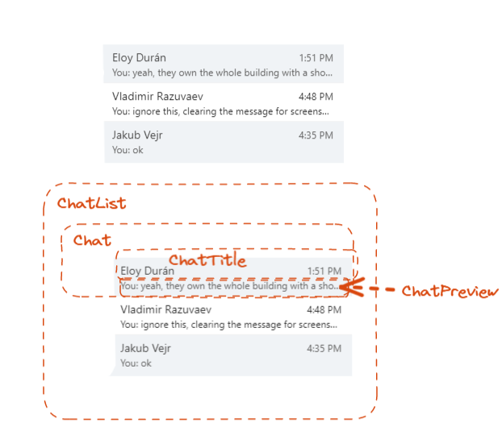

# GraphQL Schema Design

GraphQL Schema is a contract between UX and data provider. In most cases in the wild, data provider is a server. In TMP data provider is the execution layer (CDL and other resolvers). Regardless, the key is that it's a contract to provide the data in a way that is most useful for the UX. GraphQL's goal is rarely to provide a generic data layer or CRUD (unless UX is actually a CRUD UX), but to satisfy and abstract business logic through this contract.

UX-es are inherently nested and spread multiple concepts. That's why GraphQL schema is often connected and it is not split into hard domains.

## Designing a schema for an UX - step by step tutorial

The start of beginning of any schema is studying of the use case. For schema the use case is usually a UX design. Just like with React, it's wise to pre-plan how a UX design will be split into components. Then for each component, one can go through the following workflow.

<details><summary>Example - simple ChatList - component tree</summary>

Lets look a (simplified) chat list component. We start with a first iteration, where a chat list has chats with people and no pictures. We divide the UX into components and take a look on each individual component.



</details>

1. Starting from the leaf components of the UX, determine conceptually what data it needs to render. You can think of this data as of props that you'd pass to the component in order to render it. You can then convert those props into GraphQL fragments and combine them to form a top level fragment.

> Think about how data in the components relate to each other. Does data form same parent-child relationship as the components? Very often it should. Thinking of that will guide you to model relations between types correctly.

<details><summary>Example - simple ChatList - modelling data requirements and a query</summary>

1. ConversationInfo needs a title of the chat. It also needs timestamp of the last message, summary of the message contents and a name of the author. So it would need to use types that represent Chat, Message and User.
2. Chat doesn't render anything by itself, but needs to render ConversationInfo. So they need to represent Chat.
3. ChatList needs a list of fields that Chat needs.

We can see that conversation info needs 3 different types (Chat, Message and User). At this stage, you should consider how this data relates to each other. Author of the message makes sense only within context of that message, otherwise it can be any arbitrary user. Similarly, in the whole message set, the key property of the last message is that it's the last message of the particular chat. This all guides us to decide that they should be part of the fields one can select in the chat.

> Note how even though a Chat object would probably have a list of all messages, we don't use that and then get the message on client side. Always prefer doing specialized fields for your particular UX, rather than solving that business logic on the React layer.

Once we figured out the data and the relationships between data.

```graphql
fragment ConvesationInfoFragment on Chat {
  id
  title
  lastMessage {
    id
    author {
      id
      name
    }
    excrept
    timestamp
  }
}

fragment ChatFragment on Chat {
  id
  ...ConversationInfoFragment
}

fragment ChatListFragment on ChatConnection {
  nodes {
    ...ChatFragment
  }
}
```

> Note how we add `id` fields the fragments too - including entities like "lastMessage" and "author". This is so that our GraphQL client can smartly normalize it and provide us with better updating experience.
>
> "Connection" is a GraphQL pattern for doing paginated list data. We will cover it in detail later.

</details>

1. Check if you have all the required fields in the types that you are querying with fragment. If not, or if you don't have types, create them.

<details><summary>Example - simple ChatList - schema</summary>

Here we pretend we don't have those types defined. Let's define them using GraphQL Schema Definition Language.

```graphql
type Chat implements Node {
  id: ID!
  title: String
  lastMessage: Message
}

type Message implements Node {
  id: ID!
  excerpt: String
  timestamp: DateTime
  author: User
}

type User implements Node {
  id: ID!
  name: String
}

type ChatConnection {
  nodes: [Chat!]!
}
```

> Note that all types implement `Node` interface. `Node` interface should be implemented by all objects that have a unique id - and all objects that you can return from root fields should have one.

</details>

> If looking at a chat list component, you are trying to render a list of chats. You should see if there is a chat type and if there is already a paginated collection type for Chat (like a ChatConnection type). For child components, you might have an icon of a group (indicating a need of a Group type), an avatar of a user (User type) or last message (Message type).

a. Does the type provide all the data that is required for this component?

>

b. If some data is missing, if it's contextual or not
c. determine if there are relations to the parent and child types

1. Create new types for components that miss them

2. Determine if there is a Query root field that can return the root type in a correct context.

3. Enumerate the interactions that the user can make with the UX, and deterimine if there are existing mutation types that cover this UX

4. Subscriptions

### Examples

1. Designing a chat list - only user chats
2. Adding stuff to chat list - groups, contextual data, unions/interfaces
3. Root fields, pagination, pagination context
4. Context advanced example - me user, presence, etc

## Contextuality - driving business logic with schema

## Root fields

### Queries

### Mutations

### Subscriptions

## Node interface

## Pagination and connection pattern
